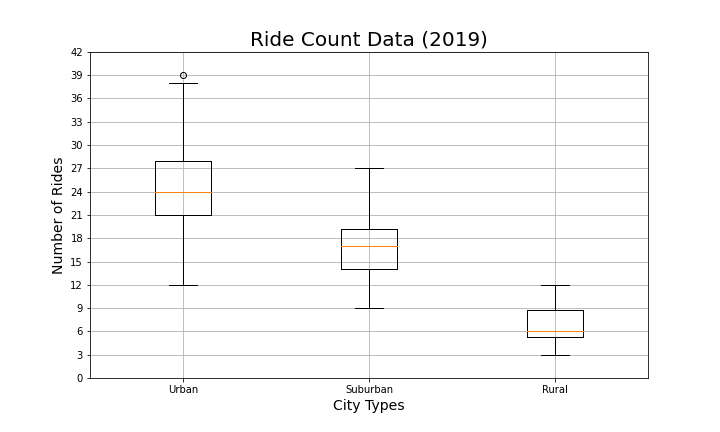
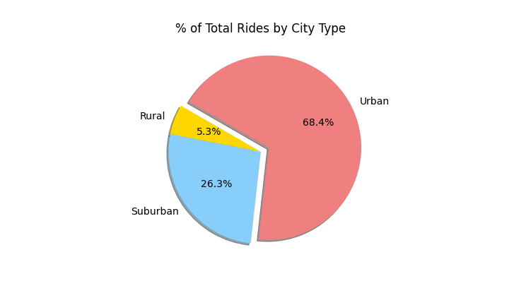
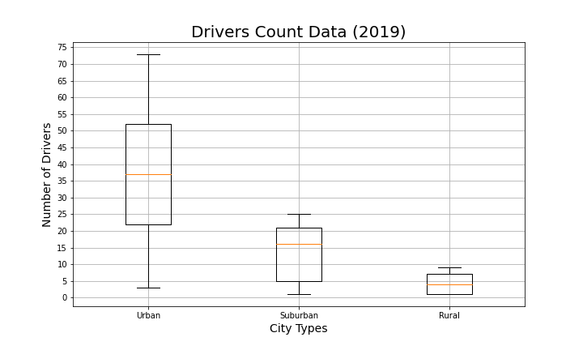
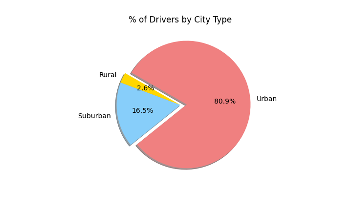
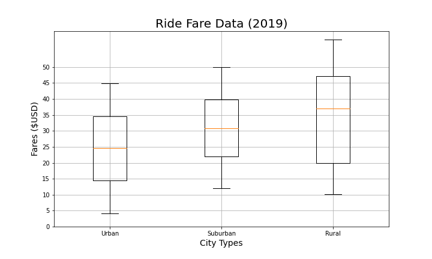
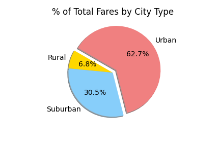
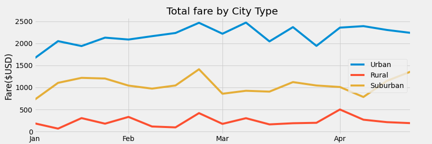

# PyBer data analysis
## Overview of the analysis
We'll be performing an exploratoy analysis on Pyber (a ride-sharing app) data, by creating visualizations that showcase the relatiosnhip between the type of city and the number of drivers and riders, as well as the percentage of total fares, riders and drivers by type city. Our analysis and visualizations will help Pyber improve access to ride sharing services and determine affordability for underserved neighborhoods.

## Results
-After we merged our datasets, and made new dataframes, one for each city type (urban, rural and suburban) we created a scatter plot, in wich each dot represents a city, and the size of each dot represents the number of rides registered. The y-axis represents the average fare. We see that rural areas have lower access to Pyber services, which translates in fewer rides in those areas and higher fares per ride as well. 

- We can have other perspective on the number of rides by city type
  

- And also, the percentage of rides by city
  

  
- The scarce number of rides in rural cities respond to the low number of drivers in such areas
  
   
  
- By not having as many costumers, the average fare in rural cities goes up to 12 dollars above the averages of their urban and suburban counterparts
  
 
- Still, even with those prices, rural cities' profit constitutes only 6.6% of the total fares

-Finally, the total fare by city type is displayed on the next table and line chart
 

## Summary
- Adding to the Pyber data, a columns that cholds the time invested on each ride, in that way we could calculate the fare by the minute, and wether the ride is in a city or in rural areas, we could adapt the fee on each ride
- Give better comissions for rural rides as an incentive to have more drivers there
- Study the trends among rural rides, to see if we find a pattern on trips (routes and locations), that way the app could offer service based on a common spot (base) for their customers if they use it regularly
